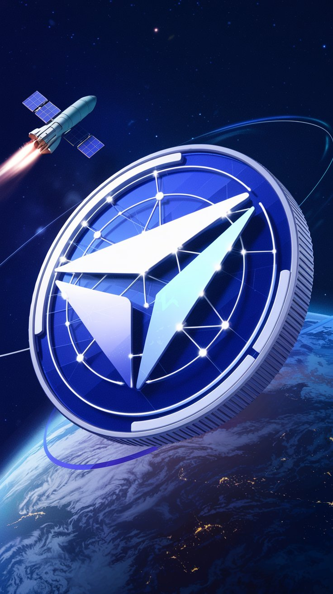

# 🌌 Orion DAO: **Revolucionando a Ciência e Tecnológica**
A **Orion DAO** é uma organização inovadora, projetada para transformar o cenário da ciência e tecnologia através da colaboração global e descentralizada. Atuamos como uma ponte entre cientistas visionários, investidores estratégicos e desenvolvedores de ponta, com o objetivo de acelerar o progresso humano por meio de ideias disruptivas e projetos de impacto mundial.

  

## 🚀 Nossa Missão
A missão da **Orion DAO** é clara: **catalisar o avanço científico e tecnológico**, fornecendo um ambiente colaborativo onde projetos de vanguarda possam ser financiados, desenvolvidos e implementados. Utilizamos a tecnologia blockchain para conectar mentes brilhantes de diversas disciplinas, garantindo que a inovação seja compartilhada de forma aberta e acessível, gerando impacto tanto social quanto financeiro.

## ⚙️ Como Aceleramos o Progresso Científico?
| **Mecanismo**                        | **Descrição Detalhada**                                                                                                                                                  |
|-------------------------------------|----------------------------------------------------------------------------------------------------------------------------------------------------------------------------|
| 💰 **Financiamento Descentralizado** | Eliminamos intermediários e possibilitamos que projetos recebam financiamento diretamente da comunidade global, com decisões transparentes e democráticas.             |
| 🌐 **Colaboração Global**            | Conectamos talentos de todo o mundo para colaborar em projetos disruptivos, aproveitando o conhecimento coletivo e a diversidade de ideias para otimizar o desenvolvimento. |
| 📈 **Transparência e Auditabilidade** | Usamos blockchain para registrar todas as etapas de pesquisa e desenvolvimento, garantindo transparência e verificabilidade, com auditorias abertas e contínuas.       |
| 🔗 **Tokenização da Propriedade Intelectual** | Representamos a propriedade intelectual por meio de **NFTs**, distribuindo os ganhos de forma justa entre os apoiadores do projeto.                                    |
| 🎟️ **Tokenização de Projetos**       | Cada projeto recebe uma estrutura de tokenização própria, permitindo que investidores apoiem diretamente iniciativas específicas e obtenham retornos financeiros à medida que o projeto avança. |

## 🎯 Benefícios Exclusivos para Membros
| **Vantagem** | **Descrição Detalhada** |
| ------------ | ----------------------- |
| 🗳️ **Governança Participativa** | Tokens que concedem poder de voto ativo, permitindo que os membros decidam democraticamente sobre quais projetos serão financiados e apoiados. |
| 🚀 **Acesso Antecipado a Inovações** | Tenha acesso exclusivo a tecnologias emergentes e participe de suas primeiras fases de desenvolvimento e entrada no mercado. |
| 💡 **Propriedade Intelectual Tokenizada** | Receba NFTs que representam uma fatia da propriedade intelectual de projetos, incluindo ganhos futuros com patentes e licenciamento de tecnologias inovadoras. |
| 🌍 **Impacto Global** | Envolva-se em projetos que têm o poder de transformar indústrias inteiras, como biotecnologia, inteligência artificial e energias limpas, contribuindo para resolver grandes desafios globais. |
| 💸 **Retorno Financeiro Sustentável** | Combine impacto social com retorno financeiro. Cada investimento em um projeto pode gerar lucro enquanto promove soluções que melhoram a sociedade. |

## 🌟 Exemplo de Projeto Pioneiro
**Projeto: Terapias Gênicas para Doenças Raras**
A **Orion DAO** apoia o desenvolvimento de terapias gênicas focadas em doenças raras, um setor geralmente negligenciado pela indústria farmacêutica devido ao baixo retorno comercial. Com a estrutura de financiamento descentralizado, podemos reunir fundos globais para apoiar equipes de pesquisa independentes focadas em soluções inovadoras para essas condições.
### Fases do Projeto
1. **Pesquisa e Desenvolvimento Inicial**: A DAO financiará o sequenciamento genético de pacientes e o desenvolvimento de vetores virais capazes de corrigir mutações específicas no DNA, explorando terapias gênicas de ponta.
2. **Ensaios Clínicos**: Com a liberação de fundos baseada na aprovação dos membros da DAO, a pesquisa avançará para ensaios clínicos, onde a segurança e a eficácia das terapias serão rigorosamente testadas.
3. **NFTs de Propriedade Intelectual**: Membros da DAO que contribuírem para o projeto receberão NFTs representando uma participação nos direitos de propriedade intelectual. Esses tokens poderão ser comercializados ou valorizados à medida que o tratamento progredir.
4. **Licenciamento Global**: Quando a terapia se provar eficaz, a DAO negociará com empresas farmacêuticas para licenciar o tratamento, gerando retorno financeiro para os membros e garantindo que a terapia seja acessível a pacientes em todo o mundo.

### 🌍 Impacto Global
Esse projeto tem o potencial de salvar vidas e melhorar a qualidade de vida de milhões de pessoas afetadas por doenças raras. Ao financiar diretamente essas pesquisas, a **Orion DAO** demonstra como a ciência descentralizada pode resolver desafios globais negligenciados por modelos tradicionais de pesquisa e desenvolvimento.

## 🌱 Nosso Impacto no Futuro
A **Orion DAO** está comprometida em financiar e desenvolver projetos que podem transformar a humanidade. Seja em biotecnologia, inteligência artificial, energias renováveis ou outras áreas essenciais, proporcionamos uma plataforma onde cientistas, desenvolvedores e investidores podem colaborar para criar soluções inovadoras que moldarão o futuro.
