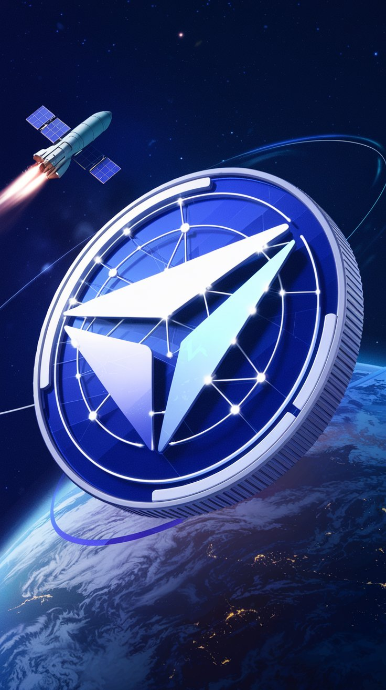

# 🌌 Orion DAO: **Revolucionando a Ciência e a Tecnologia**
A **Orion DAO** é uma organização inovadora, projetada para transformar o cenário da ciência e tecnologia através da colaboração global e descentralizada. Atuamos como uma ponte entre cientistas visionários, investidores estratégicos e desenvolvedores de ponta, com o objetivo de acelerar o progresso humano por meio de ideias disruptivas e projetos de impacto mundial.

  

## 🚀 Nossa Missão
A missão da **Orion DAO** é clara: **catalisar o avanço científico e tecnológico**, fornecendo um ambiente colaborativo onde projetos de vanguarda possam ser financiados, desenvolvidos e implementados. Utilizamos a tecnologia blockchain para conectar mentes brilhantes de diversas disciplinas, garantindo que a inovação seja compartilhada de forma aberta e acessível, gerando impacto tanto social quanto financeiro.

## ⚙️ Como Aceleramos o Progresso Científico?
| **Mecanismo**                        | **Descrição**                                                                                                          |
|-------------------------------------|------------------------------------------------------------------------------------------------------------------------|
| 🔗 **Tokenização da Propriedade**     | Representa a propriedade intelectual com NFTs, distribuindo ganhos entre apoiadores.                                  |
| 🌐 **Colaboração Global**            | Conecta talentos globais para colaborar em projetos, aproveitando a diversidade de ideias.                              |
| 💰 **Financiamento**                 | Financiamento direto de projetos pela comunidade, sem intermediários, com decisões transparentes.                       |
| 🎟️ **Tokenização de Projetos**       | Cada projeto tem sua própria estrutura de tokens, permitindo retornos conforme o progresso.                             |
| 📈 **Transparência**                 | Usa blockchain para registrar todas as etapas do projeto, garantindo transparência e auditabilidade.                    |

## 🌟 Exemplo de Projeto Pioneiro
**Projeto: Terapias Gênicas para Doenças Raras**
A **Orion DAO** apoia o desenvolvimento de terapias gênicas focadas em doenças raras, um setor geralmente negligenciado pela indústria farmacêutica devido ao baixo retorno comercial. Com a estrutura de financiamento descentralizado, podemos reunir fundos globais para apoiar equipes de pesquisa independentes focadas em soluções inovadoras para essas condições.
### Fases do Projeto
1. **Pesquisa e Desenvolvimento Inicial**: A DAO financiará o sequenciamento genético de pacientes e o desenvolvimento de vetores virais capazes de corrigir mutações específicas no DNA, explorando terapias gênicas de ponta.
2. **Ensaios Clínicos**: Com a liberação de fundos baseada na aprovação dos membros da DAO, a pesquisa avançará para ensaios clínicos, onde a segurança e a eficácia das terapias serão rigorosamente testadas.
3. **NFTs de Propriedade Intelectual**: Membros da DAO que contribuírem para o projeto receberão NFTs representando uma participação nos direitos de propriedade intelectual. Esses tokens poderão ser comercializados ou valorizados à medida que o tratamento progredir.
4. **Licenciamento Global**: Quando a terapia se provar eficaz, a DAO negociará com empresas farmacêuticas para licenciar o tratamento, gerando retorno financeiro para os membros e garantindo que a terapia seja acessível a pacientes em todo o mundo.

## 🌍 Impacto Global
Esse projeto tem o potencial de salvar vidas e melhorar a qualidade de vida de milhões de pessoas afetadas por doenças raras. Ao financiar diretamente essas pesquisas, a **Orion DAO** demonstra como a ciência descentralizada pode resolver desafios globais negligenciados por modelos tradicionais de pesquisa e desenvolvimento.

## 🎯 Benefícios Exclusivos para Membros
| **Vantagem** | **Descrição** |
| ------------ | ------------- |
| 🗳️ **Governança Participativa** | Tokens permitem votação democrática sobre quais projetos receberão apoio. |
| 🚀 **Acesso Antecipado a Inovações** | Acesso exclusivo a novas tecnologias e suas fases iniciais.                |
| 💡 **Propriedade Intelectual Tokenizada** | NFTs que representam uma parte da propriedade intelectual e ganhos futuros. |
| 💸 **Retorno Financeiro Sustentável** | Lucro com investimentos que também promovem soluções sociais.              |

## 🌱 Nosso Impacto no Futuro
A **Orion DAO** está comprometida em financiar e desenvolver projetos que podem transformar a humanidade. Seja em biotecnologia, inteligência artificial, energias renováveis ou outras áreas essenciais, proporcionamos uma plataforma onde cientistas, desenvolvedores e investidores podem colaborar para criar soluções inovadoras que moldarão o futuro.

## 📝 Nota
Este projeto é para fins educacionais, feito para o desafio da **DIO** em parceria com a **Binance**.

 

---

  Desenvolvido por <a href="https://github.com/seuUsuario">Ricardo Andreotti Gonçalves</a> 🧑‍💻

---
